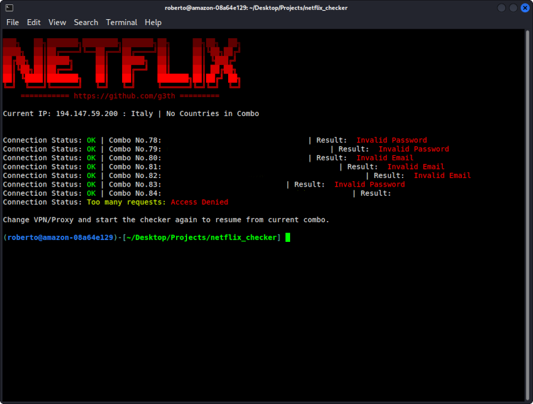

# Netflix Account Checker
## Easy Webdriver Account Checker
### Have a Netflix Combo-List? Name it 'netflix' and check it out.

Checks Netflix accounts using Selenium-Webdriver, without headless mode for now.

Due to its slow speed, the checker has the ability to resume in case of a 403 error or other errors. Change your VPN and restart the program, and it will resume where it left off.

The script was greatly simplified, as the previous options (such as the ability to choose how to split your combo-list) were not considered very useful.

Built for Debian/Kali linux or other Linux distributions. Usable in Windows, but without the same Linux terminal capabilities. Enjoy.

Ingredients:

BS4

Chromedriver

Selenium

Your own combolist
